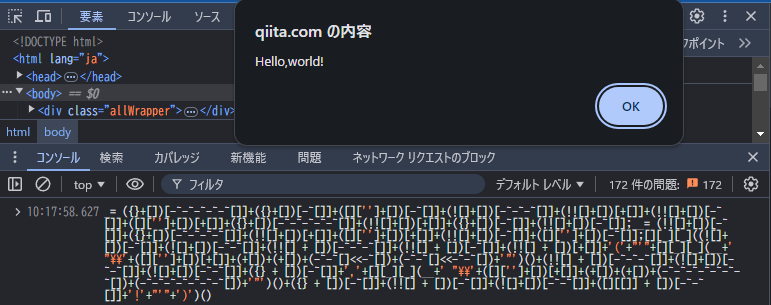

# JavaScriptを記号だけに(関数名やキーワードも)変換するプログラム

[JavaScript で Hello,world! に挑戦 (ただし記号だけを使って)](https://blog.mudatobunka.org/entry/2024/09/02/140311)という記事をみて、記号だけ(アルファベットを使わない)でプログラムができることを知りました

例えば、こんな`hello world!`プログラムが
```javascript
alert('Hello,world!')
```
こんな形に変換されます
```javascript
_= ({}+[])[-~-~-~-~-~[]]+({}+[])[-~[]]+([]['']+[])[-~[]]+(![]+[])[-~-~-~[]]+(!![]+[])[+[]]+(!![]+[])[-~[]]+([]['']+[])[+[]]+({}+[])[-~-~-~-~-~[]]+(!![]+[])[+[]]+({}+[])[-~[]]+(!![]+[])[-~[]];__= (!![]+[])[-~[]]+({}+[])[-~-~-~-~[]]+(!![]+[])[+[]]+([]['']+[])[+[]]+(!![]+[])[-~[]]+([]['']+[])[-~[]];[][_][_]((![]+[])[-~[]]+(![]+[])[-~-~[]]+(!![] + [])[-~-~-~[]]+(!![] + [])[-~[]]+(!![] + [])[+[]]+'('+"'"+[][_][_](__+' "\\'+([]['']+[])[+[]]+(+[])+(+[])+(-~-~[]<<-~[])+(-~-~[]<<-~-~[])+'"')()+(!![] + [])[-~-~-~[]]+(![]+[])[-~-~[]]+(![]+[])[-~-~[]]+({} + [])[-~[]]+','+[][_][_](__+' "\\'+([]['']+[])[+[]]+(+[])+(+[])+(-~-~-~-~-~-~-~[])+(-~-~-~-~-~-~-~[])+'"')()+({} + [])[-~[]]+(!![] + [])[-~[]]+(![]+[])[-~-~[]]+([][[]] + [])[-~-~[]]+'!'+"'"+')')()
```

ブラウザのコンソールから実行すると、ちゃんと`hello world!`が表示されました



## 変換プログラムの使い方

node.js のプログラムです

* 数値、アルファベットだけ対応しています(漢字等は変換できません)

### converter.mjs

標準出力からJavaScriptソースを受け取り、変換結果を標準出力へ返します
```bash
$ echo 'alert("Hello,world!")' | node converter.mjs
_= ({}+[])[-~-~-~-~-~[]]+({}+[])[-~[]]+([]['']+[])[-~[]]+(![]+[])[-~-~-~[]]+(!![]+[])[+[]]+(!![]+[])[-~[]]+([]['']+[])[+[]]+({}+[])[-~-~-~-~-~[]]+(!![]+[])[+[]]+({}+[])[-~[]]+(!![]+[])[-~[]];__= (!![]+[])[-~[]]+({}+[])[-~-~-~-~[]]+(!![]+[])[+[]]+([]['']+[])[+[]]+(!![]+[])[-~[]]
+([]['']+[])[-~[]];[][_][_]((![]+[])[-~[]]+(![]+[])[-~-~[]]+(!![] + [])[-~-~-~[]]+(!![] + [])[-~[]]+(!![] + [])[+[]]+'('+'"'+[][_][_](__+' "\\'+([]['']+[])[+[]]+(+[])+(+[])+(-~-~[]<<-~[])+(-~-~[]<<-~-~[])+'"')()+(!![] + [])[-~-~-~[]]+(![]+[])[-~-~[]]+(![]+[])[-~-~[]]+({} + [])[
-~[]]+','+[][_][_](__+' "\\'+([]['']+[])[+[]]+(+[])+(+[])+(-~-~-~-~-~-~-~[])+(-~-~-~-~-~-~-~[])+'"')()+({} + [])[-~[]]+(!![] + [])[-~[]]+(![]+[])[-~-~[]]+([][[]] + [])[-~-~[]]+'!'+'"'+')')()
```

※Windows環境(git bash)で`stdin is not a tty`というエラーが出る場合は、nodeに拡張子をつけて実行してください
```bash
$ echo 'alert("Hello,world!")' | node.exe converter.mjs
```


## 変換プログラムの説明

仕組みはアイディアの元になった[こちら](https://blog.mudatobunka.org/entry/2024/09/02/140311)のページをご参照ください

https://blog.mudatobunka.org/entry/2024/09/02/140311


### (ちょっとだけ)補足

#### まず数字の作り方

* 評価結果が`0`になる式を作る（空配列に`+`をつけることで数値として評価される）
```js
> +[]
0
```

* 0の補数は-1になる
```js
> ~+[]
-1
```

* -1の符号を逆転
```js
> -~+[]
1
```

* さらに補数をとると-2になる(以降繰り返すことで大きな数字を作ることができる)
```js
> ~-~+[]
-2
```

大きな数を作る場合は式が長くなるので、シフト演算で短縮したりできます（2を2bit左シフトすれば`8`になります）
```js
> -~-~[]<<-~-~[]
8
```

次に文字の作り方ですが、大きく分けて2つあります

#### ①JavaScriptで評価した結果を文字列化して、そこから[index]で切り取る方法

評価結果が`false`になる式を作成して、それを文字列化`+[]`して、最初の1文字を切り取る`[0]`と`f`を得ることができます

* 評価結果が`false`になる式を作る
```js
> ![]
false
```

* 評価結果`false`を文字列化(`+[]`)する
```js
> ![]+[]
'false'
```

* 評価結果`'false'`から1文字取り出す
```js
> (![]+[])[0]
'f'
```

* `0`になる式と合わせると、記号のみで`f`を作成することができました
```js
> (![]+[])[+[]]
`f`
```

※ 評価結果から文字を切り出す際に使える式（すべてのアルファベットを作ることはできません）
```javascript
![]+[]; // 'false'
!![]+[]; // 'true'
{}+[]; // '[object Object]'
[][[]]+[]; // 'undefined'
-~[]/[]+[]; // 'Infinity'
(+{}+[]); // 'NaN'
```

#### ②文字エスケープ(文字コード)から文字を生成する方法

`A`という文字は、①の切り出し法では生成できないので、文字エスケープ(\uHHHH)から作ります

```javascript
> Function('return "\u0041"')()
'A'
```

* `Function()`はこれで調達できるそうです
```
> [].constructor.constructor
{ [native code] }[Function: Function]
```

* なので下記の形に書き換えることができます
```javascript
> [].constructor.constructor('return "\u0041"')()
'A'
```

* さらにプロパティーへのアクセスを`.`から`[]`に変更することで、文字列(`'constructor'`, `'return'`)に置き換えることができます
```javascript
> []['constructor']['constructor']('return "\u0041"')()
'A'
```

* `'constructor'`も`'return'`も`'\u0041'`も、①で作った文字の組み合わせで生成できるので・・・・
```javascript
> ({}+[])[-~-~-~-~-~[]]+({}+[])[-~[]]+([]['']+[])[-~[]]+(![]+[])[-~-~-~[]]+(!![]+[])[+[]]+(!![]+[])[-~[]]+([]['']+[])[+[]]+({}+[])[-~-~-~-~-~[]]+(!![]+[])[+[]]+({}+[])[-~[]]+(!![]+[])[-~[]]
'constructor'
>  (!![]+[])[-~[]]+({}+[])[-~-~-~-~[]]+(!![]+[])[+[]]+([]['']+[])[+[]]+(!![]+[])[-~[]]+([]['']+[])[-~[]]
'return'
> ' "\\'+([]['']+[])[+[]]+(+[])+(+[])+(-~-~[]<<-~[])+(-~[])+'"'
' "\\u0041"'
```

* 組み合わせることで、記号から`A`を作り出すことができました
```javascript
> [][(({}+[])[-~-~-~-~-~[]]+({}+[])[-~[]]+([]['']+[])[-~[]]+(![]+[])[-~-~-~[]]+(!![]+[])[+[]]+(!![]+[])[-~[]]+([]['']+[])[+[]]+({}+[])[-~-~-~-~-~[]]+(!![]+[])[+[]]+({}+[])[-~[]]+(!![]+[])[-~[]])][(({}+[])[-~-~-~-~-~[]]+({}+[])[-~[]]+([]['']+[])[-~[]]+(![]+[])[-~-~-~[]]+(!![]+[]
)[+[]]+(!![]+[])[-~[]]+([]['']+[])[+[]]+({}+[])[-~-~-~-~-~[]]+(!![]+[])[+[]]+({}+[])[-~[]]+(!![]+[])[-~[]])]((!![]+[])[-~[]]+({}+[])[-~-~-~-~[]]+(!![]+[])[+[]]+([]['']+[])[+[]]+(!![]+[])[-~[]]+([]['']+[])[-~[]]+' "\\'+([]['']+[])[+[]]+(+[])+(+[])+(-~-~[]<<-~[])+(-~[])+'"')()
'A'
```

## プログラムソース
```javascript:converter.mjs
/**
 * JavaScript obfuscator program
 *  @license MIT
 */
import * as readline from 'readline';

const chars = {
  ' ': `({} + [])[-~-~-~-~-~-~-~[]]`,
  0: `(+[])+[]`,
  1: `-~[]`,
  2: `-~-~[]`,
  3:` -~-~-~[]`,
  4:` (-~-~[]<<-~[])+[]`,
  5:` -~-~-~-~-~[]`,
  6:` -~-~-~-~-~-~[]`,
  7:` -~-~-~-~-~-~-~[]`,
  8:` (-~-~[]<<-~-~[])+[]`,
  9:` (-~-~-~[]*-~-~-~[])+[]`,
  a: `(![]+[])[-~[]]`,
  b: `({}+[])[-~-~[]]`,
  c: `({}+[])[-~-~-~-~-~[]]`,
  d: `([][[]] + [])[-~-~[]]`,
  e: `(!![] + [])[-~-~-~[]]`,
  f: `(![] + [])[+[]]`,
  g: `(([]+[])[({}+[])[-~-~-~-~-~[]]+({}+[])[-~[]]+([]['']+[])[-~[]]+(![]+[])[-~-~-~[]]+(!![]+[])[+[]]+(!![]+[])[-~[]]+([]['']+[])[+[]]+({}+[])[-~-~-~-~-~[]]+(!![]+[])[+[]]+({}+[])[-~[]]+(!![]+[])[-~[]]]+[])[-~-~-~-~-~-~-~-~-~-~-~-~-~-~[]]`,
  h: `[][_][_](__+' "\\\\'+([]['']+[])[+[]]+(+[])+(+[])+(-~-~-~-~-~-~[])+(-~-~-~-~-~-~-~-~[])+'"')()`,
  i: `([][[]] + [])[-~-~-~-~-~[]]`,
  j: `({} + [])[-~-~-~[]]`,
  k: `[][_][_](__+' "\\\\'+([]['']+[])[+[]]+(+[])+(+[])+(-~-~-~-~-~-~[])+({}+[])[-~-~[]]+'"')()`,
  l: `(![]+[])[-~-~[]]`,
  m: `((+[])[({}+[])[-~-~-~-~-~[]]+({}+[])[-~[]]+([]['']+[])[-~[]]+(![]+[])[-~-~-~[]]+(!![]+[])[+[]]+(!![]+[])[-~[]]+([]['']+[])[+[]]+({}+[])[-~-~-~-~-~[]]+(!![]+[])[+[]]+({}+[])[-~[]]+(!![]+[])[-~[]]]+[])[-~-~-~-~-~-~-~-~-~-~-~[]]`,
  n: `([][[]] + [])[-~[]]`,
  o: `({} + [])[-~[]]`,
  p: `(/ /[({}+[])[-~-~-~-~-~[]]+({}+[])[-~[]]+([]['']+[])[-~[]]+(![]+[])[-~-~-~[]]+(!![]+[])[+[]]+(!![]+[])[-~[]]+([]['']+[])[+[]]+({}+[])[-~-~-~-~-~[]]+(!![]+[])[+[]]+({}+[])[-~[]]+(!![]+[])[-~[]]]+[])[-~-~-~-~-~-~-~-~-~-~-~-~-~-~[]]`,
  q: `[][_][_](__+' "\\\\'+([]['']+[])[+[]]+(+[])+(+[])+(-~-~-~-~-~-~-~[])+(-~[])+'"')()`,
  r: `(!![] + [])[-~[]]`,
  s: `(![] + [])[-~-~-~[]]`,
  t: `(!![] + [])[+[]]`,
  u: `([][[]] + [])[+[]]`,
  v: `([][({}+[])[-~-~-~-~-~[]]+({}+[])[-~[]]+([]['']+[])[-~[]]+(![]+[])[-~-~-~[]]+(!![]+[])[+[]]+(!![]+[])[-~[]]+([]['']+[])[+[]]+({}+[])[-~-~-~-~-~[]]+(!![]+[])[+[]]+({}+[])[-~[]]+(!![]+[])[-~[]]]+[])[-~-~-~-~-~-~-~-~-~-~-~-~-~-~-~-~-~-~-~-~-~-~-~-~[]]`,
  w: `[][_][_](__+' "\\\\'+([]['']+[])[+[]]+(+[])+(+[])+(-~-~-~-~-~-~-~[])+(-~-~-~-~-~-~-~[])+'"')()`,
  x: `(/ /[({}+[])[-~-~-~-~-~[]]+({}+[])[-~[]]+([]['']+[])[-~[]]+(![]+[])[-~-~-~[]]+(!![]+[])[+[]]+(!![]+[])[-~[]]+([]['']+[])[+[]]+({}+[])[-~-~-~-~-~[]]+(!![]+[])[+[]]+({}+[])[-~[]]+(!![]+[])[-~[]]]+[])[-~-~-~-~-~-~-~-~-~-~-~-~-~[]]`,
  y: `(-~[] / [] + [])[-~-~-~-~-~-~-~[]]`,
  z: `[][_][_](__+' "\\\\'+([]['']+[])[+[]]+(+[])+(+[])+(-~-~-~-~-~-~-~[])+(![]+[])[-~[]]+'"')()`,
  A: `[][_][_](__+' "\\\\'+([]['']+[])[+[]]+(+[])+(+[])+(-~-~[]<<-~[])+(-~[])+'"')()`,
  B: `[][_][_](__+' "\\\\'+([]['']+[])[+[]]+(+[])+(+[])+(-~-~[]<<-~[])+(-~-~[])+'"')()`,
  C: `[][_][_](__+' "\\\\'+([]['']+[])[+[]]+(+[])+(+[])+(-~-~[]<<-~[])+(-~-~-~[])+'"')()`,
  D: `[][_][_](__+' "\\\\'+([]['']+[])[+[]]+(+[])+(+[])+(-~-~[]<<-~[])+(-~-~[]<<-~[])+'"')()`,
  E: `[][_][_](__+' "\\\\'+([]['']+[])[+[]]+(+[])+(+[])+(-~-~[]<<-~[])+(-~-~-~-~-~[])+'"')()`,
  F: `[][_][_](__+' "\\\\'+([]['']+[])[+[]]+(+[])+(+[])+(-~-~[]<<-~[])+(-~-~-~-~-~-~[])+'"')()`,
  G: `[][_][_](__+' "\\\\'+([]['']+[])[+[]]+(+[])+(+[])+(-~-~[]<<-~[])+(-~-~-~-~-~-~-~[])+'"')()`,
  H: `[][_][_](__+' "\\\\'+([]['']+[])[+[]]+(+[])+(+[])+(-~-~[]<<-~[])+(-~-~[]<<-~-~[])+'"')()`,
  I: `(-~[]/[]+[])[+[]]`,
  J: `[][_][_](__+' "\\\\'+([]['']+[])[+[]]+(+[])+(+[])+(-~-~[]<<-~[])+((![]+[])[-~[]])+'"')()`,
  K: `[][_][_](__+' "\\\\'+([]['']+[])[+[]]+(+[])+(+[])+(-~-~[]<<-~[])+(({}+[]+[])[-~-~[]])+'"')()`,
  L: `[][_][_](__+' "\\\\'+([]['']+[])[+[]]+(+[])+(+[])+(-~-~[]<<-~[])+(({}+[])[-~-~-~-~-~[]])+'"')()`,
  M: `[][_][_](__+' "\\\\'+([]['']+[])[+[]]+(+[])+(+[])+(-~-~[]<<-~[])+(([][[]] + [])[-~-~[]])+'"')()`,
  N: `(+{}+[])[+[]]`,
  O: `({}+[])[-~-~[]<<-~-~[]]`,
  P: `[][_][_](__+' "\\\\'+([]['']+[])[+[]]+(+[])+(+[])+(-~-~-~-~-~[])+(+[])+'"')()`,
  Q: `[][_][_](__+' "\\\\'+([]['']+[])[+[]]+(+[])+(+[])+(-~-~-~-~-~[])+(-~[])+'"')()`,
  R: `(/ /[({}+[])[-~-~-~-~-~[]]+({}+[])[-~[]]+([]['']+[])[-~[]]+(![]+[])[-~-~-~[]]+(!![]+[])[+[]]+(!![]+[])[-~[]]+([]['']+[])[+[]]+({}+[])[-~-~-~-~-~[]]+(!![]+[])[+[]]+({}+[])[-~[]]+(!![]+[])[-~[]]]+[])[-~-~-~[]*-~-~-~[]]`,
  S: `(([]+[])[({}+[])[-~-~-~-~-~[]]+({}+[])[-~[]]+([]['']+[])[-~[]]+(![]+[])[-~-~-~[]]+(!![]+[])[+[]]+(!![]+[])[-~[]]+([]['']+[])[+[]]+({}+[])[-~-~-~-~-~[]]+(!![]+[])[+[]]+({}+[])[-~[]]+(!![]+[])[-~[]]]+[])[-~-~-~[]*-~-~-~[]]`,
  T: `[][_][_](__+' "\\\\'+([]['']+[])[+[]]+(+[])+(+[])+(-~-~-~-~-~[])+(-~-~[]<<-~[])+'"')()`,
  U: `[][_][_](__+' "\\\\'+([]['']+[])[+[]]+(+[])+(+[])+(-~-~-~-~-~[])+(-~-~-~-~-~[])+'"')()`,
  V: `[][_][_](__+' "\\\\'+([]['']+[])[+[]]+(+[])+(+[])+(-~-~-~-~-~[])+(-~-~-~-~-~-~[])+'"')()`,
  W: `[][_][_](__+' "\\\\'+([]['']+[])[+[]]+(+[])+(+[])+(-~-~-~-~-~[])+(-~-~-~-~-~-~-~[])+'"')()`,
  X: `[][_][_](__+' "\\\\'+([]['']+[])[+[]]+(+[])+(+[])+(-~-~-~-~-~[])+(-~-~[]<<-~-~[])+'"')()`,
  Y: `[][_][_](__+' "\\\\'+([]['']+[])[+[]]+(+[])+(+[])+(-~-~-~-~-~[])+(-~-~-~[]*-~-~-~[])+'"')()`,
  Z: `[][_][_](__+' "\\\\'+([]['']+[])[+[]]+(+[])+(+[])+(-~-~-~-~-~[])+((![]+[])[-~[]])+'"')()`,
};


const stdin = readline.createInterface({
  input: process.stdin,
});

stdin.on('line', (line) => {
    console.log(obfuscator(line));
});

export function obfuscator(src) {
  let header = '';
  // 'constructor'
  header += "_= ({}+[])[-~-~-~-~-~[]]+({}+[])[-~[]]+([]['']+[])[-~[]]+(![]+[])[-~-~-~[]]+(!![]+[])[+[]]+(!![]+[])[-~[]]+([]['']+[])[+[]]+({}+[])[-~-~-~-~-~[]]+(!![]+[])[+[]]+({}+[])[-~[]]+(!![]+[])[-~[]];";
  // 'return'
  header += "__= (!![]+[])[-~[]]+({}+[])[-~-~-~-~[]]+(!![]+[])[+[]]+([]['']+[])[+[]]+(!![]+[])[-~[]]+([]['']+[])[-~[]];";
  header += "[][_][_](";
  return `${header}${encode(src)})()`;
}

function encode(src) {
  let body = '';
  for (var c of src) {
    if (c in chars) {
      body += `${chars[c]}+`;
    }else if (c === "'") {
      body += `"${c}"+`;
    } else {
      body += `'${c}'+`;
    }
  }

  return body.slice(0, -1);
}

// const source_code = 'console.log("Hello world!")';
// console.log(obfuscator(source_code));


```
